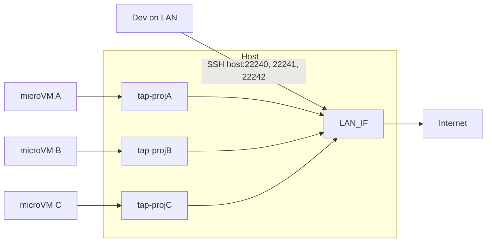
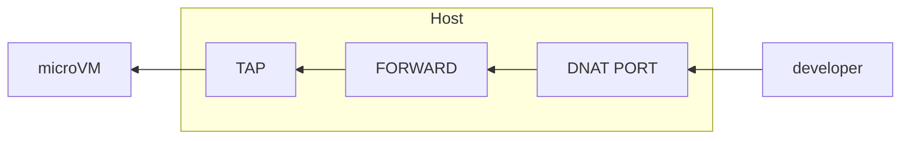
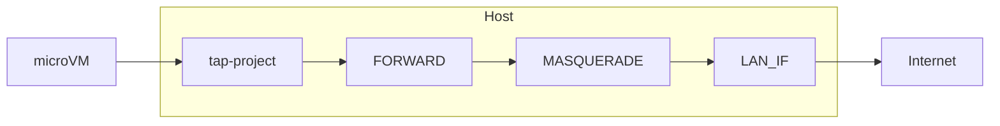
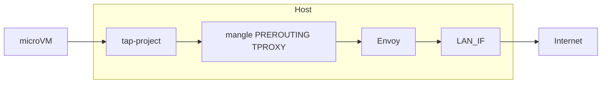

# Build a Prison
## Firecracker microVM setup for jailing workloads

This repo documents a complete setup for building and running Firecracker microVMs on an AlmaLinux 10 host.
The end result is: 
- one TAP device and a /30 subnet per microVM
- LAN-reachable SSH via a host port (DNAT)

Work in Progress
- key-only auth and metadata-driven bootstrap (Step 5)
- (optional) Envoy TPROXY on the host for egress control.

## Prerequisites (quick checklist)

- **Virtualisation Support** Your machine MUST support virtualisation
- **KVM** and host packages (IP forwarding, firewall, iproute, iptables, etc.)
- **Firecracker and jailer** installed under `/usr/local/bin` and directory layout
- **Networking scripts** (`microvm-net-up.sh` / `microvm-net-down.sh`) and TAP/NAT/SSH port forwarding

## Architecture: multiple microVMs on one host

The host uses a single LAN interface. Each project gets its own TAP device (e.g. `tap-projA`), a /30 from 172.31.0.0/16 (deterministic from project name), one microVM, and one host SSH port (e.g. 22240, 22241, 22242) with DNAT to that guest’s port 22. 
Developers on the LAN run `ssh -p PORT dev@HOST_IP`; the host DNATs to the correct microVM.

## Ingress SSH

LAN → Host (DNAT port → guest:22) → FORWARD → TAP → microVM.

## Egress Traffic flow without Envoy

**Egress:** microVM → TAP → FORWARD → MASQUERADE (NAT) → LAN_IF → Internet.

## Egress Traffic flow with Envoy TPROXY

When Envoy TPROXY is enabled (optional), all microVM **egress** is redirected on the host via iptables TPROXY to Envoy, which can enforce policy (e.g. SNI allowlist) before forwarding to the real destination. **Ingress** (SSH to the guest) is unchanged and does not pass through Envoy. Control is entirely at the host; no changes are required inside the guest.

## Documentation index

| Step | Document | Description |
|------|----------|-------------|
| 1 | [Step01.md](Step01.md) | Prepare the AlmaLinux 10 host |
| 2 | [Step02.md](Step02.md) | Install Firecracker (and jailer) |
| 3 | [Step03.md](Step03.md) | Host networking (TAP, /30, NAT, SSH port) |
| 4 | [Step04.md](Step04.md) | MicroVM runsheet (kernel, rootfs, boot, logging) |
| 5 | [Step05.md](Step05.md) | Key-only SSH and metadata-driven bootstrap |
| 6 (optional) | [ideas/Step06-Envoy-TPROXY.md](ideas/Step06-Envoy-TPROXY.md) | Envoy TPROXY egress control |

### Scripts

- **Step runners:** [run-step01.sh](run-step01.sh) … [run-step05.sh](run-step05.sh) — run or automate the corresponding step (see each StepNN.md for usage).
- **Networking:** `microvm-net-up.sh` / `microvm-net-down.sh` — create/tear down per-project TAP, NAT, and SSH DNAT (in this directory or installed to `/usr/local/sbin`; see [Step03.md](Step03.md)).
- **MicroVM management:** [microvm-list-all.sh](microvm-list-all.sh), [microvm-stop-one.sh](microvm-stop-one.sh), [microvm-stop-all.sh](microvm-stop-all.sh), [microvm-cleanup-all.sh](microvm-cleanup-all.sh) — list, stop, or clean up running microVMs.

## Quick start

Run the steps in order. Use `run-step0N.sh` where available; see each StepNN.md for details and manual commands.
