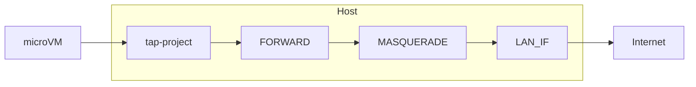
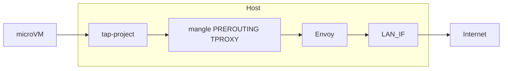

# STEP 6 — Envoy TPROXY egress control (host-level)

This step documents how to route **all** outbound traffic from Firecracker microVMs through Envoy on the host using iptables TPROXY. Control is entirely at the **host** (between TAP and LAN); no changes are required inside the guest. You can then enforce policy in Envoy (e.g. allow only certain hosts by SNI).

**Prerequisites:** Steps 1–5 complete (host prep, Firecracker, jailer, [microvm-net-up.sh](../microvm-net-up.sh) / [microvm-net-down.sh](../microvm-net-down.sh), per-project TAP + /30 + NAT as in [Step03.md](../Step03.md)).

---

## 6.1 Architecture

**Current egress path (without Envoy):**



**With Envoy TPROXY:**



Traffic from the microVM hits the TAP, then the host’s mangle PREROUTING chain redirects it to Envoy via TPROXY (preserving original destination). Envoy uses the original destination and can allow or deny by SNI (e.g. only `github.com` / `www.github.com`), then forwards allowed connections to the real destination. Envoy’s upstream connections leave via the host’s normal routing/NAT to LAN_IF.

---

## 6.2 Installing Envoy

### Option A — Tetrate GetEnvoy RPM (recommended for AlmaLinux / RHEL)

For RHEL/CentOS/AlmaLinux, use the Tetrate GetEnvoy repository. AlmaLinux 10 is EL-like; use the closest available codename (e.g. `el9` if `el10` is not listed).

```bash
sudo dnf install -y yum-utils
sudo rpm --import 'https://rpm.dl.getenvoy.io/public/gpg.CF716AF503183491.key'
curl -sL 'https://rpm.dl.getenvoy.io/public/config.rpm.txt?distro=el&codename=9' | sudo tee /etc/yum.repos.d/getenvoy.repo
sudo dnf makecache --disablerepo='*' --enablerepo='getenvoy'
sudo dnf install -y getenvoy-envoy
```

If the repo only offers `el7` or `el8`, try that and adjust; check [Envoy install docs](https://www.envoyproxy.io/docs/envoy/latest/start/install) for current URLs.

Verify:

```bash
envoy --version
# or
getenvoy run -- --version
```

### Option B — Docker

Run Envoy with host network and capabilities required for TPROXY and transparent binding:

```bash
docker run -d \
  --name envoy-egress \
  --network=host \
  --cap-add=NET_RAW \
  --cap-add=NET_ADMIN \
  -v /etc/envoy/microvm-egress.yaml:/etc/envoy/envoy.yaml:ro \
  envoyproxy/envoy:latest \
  -c /etc/envoy/envoy.yaml
```

Ensure the config path and image tag match your setup.

---

## 6.3 Host kernel and routing requirements

- **IP forwarding:** Already enabled in Step 1: `net.ipv4.ip_forward=1`.
- **TPROXY support:** Kernel modules `xt_TPROXY` and `xt_socket` must be available. Check with:
  ```bash
  sudo iptables -t mangle -j TPROXY -h
  ```
- **Policy routing:** Redirected packets must be delivered to a local socket. Use a dedicated routing table and a firewall mark:
  - Add a rule that sends marked packets to a local table: `ip rule add fwmark 1 lookup 100`
  - In that table, route local delivery: `ip route add local 0.0.0.0/0 dev lo table 100`
- **Envoy capabilities:** Envoy must bind with `IP_TRANSPARENT` and read `SO_ORIGINAL_DST`. Run it with `CAP_NET_RAW`; if binding to a port below 1024, add `CAP_NET_BIND_SERVICE`.
- **Reverse path filter:** Some setups need relaxed rp_filter for TPROXY to work:
  ```bash
  sudo sysctl -w net.ipv4.conf.all.rp_filter=0
  ```
  This can weaken reverse-path validation; use only if needed and understand the implications.

---

## 6.4 iptables TPROXY rules (egress only)

Only **egress** from microVMs is redirected to Envoy. Ingress (e.g. SSH DNAT to the guest) stays as in Step 3.

- **Table:** `mangle`, chain **PREROUTING** (traffic from the TAP is seen there before FORWARD).
- **Match:** TCP (and optionally UDP) from `172.31.0.0/16` (the microVM range). Exclude traffic destined to the host itself if desired.
- **Action:** TPROXY to Envoy’s listen port, with a mark so policy routing can deliver the packet locally.

When using Envoy TPROXY, **do not** add the usual egress FORWARD and POSTROUTING MASQUERADE rules for microVM traffic; otherwise egress would bypass Envoy. Either run a one-time host script that installs TPROXY for `172.31.0.0/16` and start Envoy, and ensure [microvm-net-up.sh](../microvm-net-up.sh) does not add egress FORWARD/MASQUERADE when Envoy is enabled (see 6.9).

**Example: one-time host setup (run as root or with sudo).**

Set the Envoy port (must match the listener in the Envoy config):

```bash
ENVOY_PORT=15001
```

Policy routing (run once per host):

```bash
ip rule add fwmark 1 lookup 100
ip route add local 0.0.0.0/0 dev lo table 100
```

TPROXY rule for all microVM egress (TCP):

```bash
iptables -t mangle -A PREROUTING -p tcp -s 172.31.0.0/16 -j TPROXY \
  --tproxy-mark 0x1/0x1 --on-port "$ENVOY_PORT"
```

Optional — UDP (e.g. for DNS) to the same or another port:

```bash
# If Envoy has a UDP listener on 15002:
# iptables -t mangle -A PREROUTING -p udp -s 172.31.0.0/16 -j TPROXY \
#   --tproxy-mark 0x1/0x1 --on-port 15002
```

Ensure Envoy is running and listening on `ENVOY_PORT` before traffic is sent.

---

## 6.5 Envoy listener and cluster configuration

- **Listener:**
  - Bind: `0.0.0.0:<ENVOY_PORT>` (same port as in TPROXY `--on-port`).
  - Set `transparent: true` so Envoy can accept TPROXY-redirected traffic and use the original destination.
  - Set `traffic_direction: OUTBOUND` for egress redirection.
  - Listener filters (order matters):
    1. `envoy.filters.listener.original_dst` — restores destination from `SO_ORIGINAL_DST`.
    2. `envoy.filters.listener.tls_inspector` — parses TLS ClientHello so SNI is available for filter chain matching.
- **Clusters:**
  - **original_dst_cluster:** type `ORIGINAL_DST`, `lb_policy: CLUSTER_PROVIDED`, used to forward allowed traffic to the real destination.
  - **reject_cluster:** type `STATIC`, single endpoint `127.0.0.1:1` (or similar). Connections that do not match the allowlist are sent here and will fail/close.
- **Filter chains:**
  - **First chain:** `filter_chain_match.server_names: ["github.com", "www.github.com"]`. Network filter: `envoy.filters.network.tcp_proxy` to `original_dst_cluster`. This allows TCP (including HTTPS) to GitHub based on SNI.
  - **Second chain (default):** no `server_names` (catch-all). TCP proxy to `reject_cluster` so any other SNI or non-TLS TCP is not forwarded.

**Caveats:**

1. Restriction is by **SNI**. Non-TLS TCP has no SNI and will match the default chain (rejected).
2. Only TCP is shown; UDP (e.g. DNS) can be added with a separate listener and optional allowlist.
3. Envoy does not perform NAT; its upstream connections use the host’s primary address unless you configure a specific source address or add host-side NAT for Envoy’s outbound traffic.

---

## 6.6 Full example Envoy config (GitHub-only allowlist)

Save as `/etc/envoy/microvm-egress.yaml` (or `build/envoy-microvm-egress-example.yaml`). Listener port must match `ENVOY_PORT` (e.g. `15001`).

```yaml
static_resources:
  listeners:
    - name: microvm_egress
      address:
        socket_address:
          address: 0.0.0.0
          port_value: 15001
      transparent: true
      traffic_direction: OUTBOUND
      listener_filters:
        - name: envoy.filters.listener.original_dst
          typed_config:
            "@type": type.googleapis.com/envoy.extensions.filters.listener.original_dst.v3.OriginalDst
        - name: envoy.filters.listener.tls_inspector
          typed_config:
            "@type": type.googleapis.com/envoy.extensions.filters.listener.tls_inspector.v3.TlsInspector
      filter_chains:
        # Allow only GitHub by SNI
        - filter_chain_match:
            server_names: ["github.com", "www.github.com"]
          filters:
            - name: envoy.filters.network.tcp_proxy
              typed_config:
                "@type": type.googleapis.com/envoy.extensions.filters.network.tcp_proxy.v3.TcpProxy
                stat_prefix: allowed_original_dst
                cluster: original_dst_cluster
        # Default: reject all other destinations
        - filter_chain_match: {}
          filters:
            - name: envoy.filters.network.tcp_proxy
              typed_config:
                "@type": type.googleapis.com/envoy.extensions.filters.network.tcp_proxy.v3.TcpProxy
                stat_prefix: rejected
                cluster: reject_cluster

  clusters:
    - name: original_dst_cluster
      type: ORIGINAL_DST
      lb_policy: CLUSTER_PROVIDED
      connect_timeout: 10s
      dns_lookup_family: V4_ONLY

    - name: reject_cluster
      type: STATIC
      connect_timeout: 1s
      load_assignment:
        cluster_name: reject_cluster
        endpoints:
          - lb_endpoints:
              - endpoint:
                  address:
                    socket_address:
                      address: 127.0.0.1
                      port_value: 1
```

---

## 6.7 Running Envoy (systemd and capabilities)

Example systemd unit: `/etc/systemd/system/envoy-microvm-egress.service`

```ini
[Unit]
Description=Envoy microVM egress proxy (TPROXY)
After=network-online.target
Wants=network-online.target

[Service]
Type=simple
ExecStart=/usr/bin/envoy -c /etc/envoy/microvm-egress.yaml
Restart=on-failure
RestartSec=5
# Required for TPROXY and transparent binding
CapabilityBoundingSet=CAP_NET_RAW CAP_NET_BIND_SERVICE
AmbientCapabilities=CAP_NET_RAW CAP_NET_BIND_SERVICE
NoNewPrivileges=true

[Install]
WantedBy=multi-user.target
```

If Envoy is installed elsewhere, change `ExecStart` (e.g. `/usr/local/bin/envoy` or `getenvoy run -- -c /etc/envoy/microvm-egress.yaml`). If the listen port is >= 1024, you can drop `CAP_NET_BIND_SERVICE`.

Enable and start:

```bash
sudo systemctl daemon-reload
sudo systemctl enable envoy-microvm-egress
sudo systemctl start envoy-microvm-egress
sudo systemctl status envoy-microvm-egress
```

One-off run with capabilities (for testing):

```bash
sudo setcap 'cap_net_raw,cap_net_bind_service=+ep' /usr/bin/envoy
envoy -c /etc/envoy/microvm-egress.yaml
```

---

## 6.8 Teardown (restore direct NAT)

To stop using Envoy and revert to direct egress NAT:

1. Stop Envoy: `sudo systemctl stop envoy-microvm-egress`
2. Remove the TPROXY rule (use the same port as in 6.4):
   ```bash
   ENVOY_PORT=15001
   sudo iptables -t mangle -D PREROUTING -p tcp -s 172.31.0.0/16 -j TPROXY \
     --tproxy-mark 0x1/0x1 --on-port "$ENVOY_PORT"
   ```
3. Remove policy routing:
   ```bash
   sudo ip rule del fwmark 1 lookup 100
   sudo ip route del local 0.0.0.0/0 dev lo table 100
   ```
4. Ensure [microvm-net-up.sh](../microvm-net-up.sh) again adds FORWARD and MASQUERADE for egress when Envoy is not in use (or re-run net-up for the project so egress goes directly to LAN).

---

## 6.9 Integration with microvm-net-up.sh and microvm-net-down.sh

When Envoy TPROXY is used for egress:

- **microvm-net-up.sh** must **not** add the two egress rules:
  - `iptables -A FORWARD -i "$TAP" -o "$LAN_IF" -j ACCEPT`
  - `iptables -t nat -A POSTROUTING -s "${HOST_IP}/${CIDR}" -o "$LAN_IF" -j MASQUERADE`
- Either:
  - **Option A:** Add an env flag (e.g. `MICROVM_EGRESS_VIA_ENVOY=1`). When set, the script skips those two rules and does not add TPROXY (TPROXY is installed once per host as in 6.4). Or
  - **Option B:** Use a separate “egress proxy” host script that sets up TPROXY and starts Envoy once; maintain a patched or alternate `microvm-net-up.sh` that omits egress FORWARD/MASQUERADE when you run with Envoy.

**microvm-net-down.sh:** Do not remove the global TPROXY rule (it applies to all microVMs). Only remove project-specific rules (e.g. SSH DNAT for that project).

---

## 6.10 Verification

1. **Host:** Envoy is listening on the TPROXY port and has the right capabilities:
   ```bash
   ss -tlnp | grep 15001
   getcap /usr/bin/envoy
   ```

2. **Policy routing and TPROXY:**
   ```bash
   ip rule list
   ip route show table 100
   sudo iptables -t mangle -L PREROUTING -n -v
   ```

3. **From a microVM** (after bringing up a project with Envoy-enabled networking and no egress FORWARD/MASQUERADE):
   - Allowed: `curl -v https://www.github.com` should succeed.
   - Rejected: `curl -v https://example.com` should fail or be closed by Envoy (connection reset or timeout).

---

## 6.11 Optional extensions

- **DNS (UDP 53):** Add a UDP listener in Envoy with TPROXY for UDP, and a small allowlist (e.g. one resolver IP) so microVMs can resolve names; keep TCP rules as above.
- **IP allowlist instead of SNI:** Restrict by destination IP (e.g. GitHub’s IP ranges) instead of TLS SNI. No TLS inspector needed; use filter chain matching on destination IP or a custom extension. Pros: works for non-TLS; cons: IPs change and you must maintain the list.
- **Envoy docs:** [Original Destination listener filter](https://www.envoyproxy.io/docs/envoy/latest/configuration/listeners/listener_filters/original_dst_filter), [Installing Envoy](https://www.envoyproxy.io/docs/envoy/latest/start/install).
